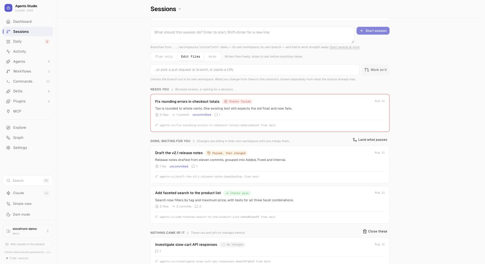

<div align="center">

# Agent Manager

**A workbench for Claude Code.**

Run several sessions at once, put recurring work on a schedule,
and see everything Claude has done for you — without leaving the browser.

<a href="#quick-start">Quick start</a> ·
<a href="#sessions">Sessions</a> ·
<a href="#daily-rituals">Rituals</a> ·
<a href="#activity">Activity</a> ·
<a href="#configuration">Configuration</a> ·
<a href="CONTRIBUTING.md">Contributing</a>


<br />



</div>

---

Agent Manager reads the `.claude` directory you already have and the repository you
point it at. Everything it shows you is a real file or a real branch; everything it
writes is something you could have written by hand. Close the app and nothing is
trapped inside it.

| Section | What it's for |
| --- | --- |
| **Sessions** | Several pieces of work at once, each on its own branch and its own checkout |
| **Daily** | Rituals — work that runs on a schedule, so the result is waiting when you get in |
| **Activity** | Every run there has ever been, with cost, duration and outcome |
| **Agents** | Subagents, their model tier and what tools each is allowed |
| **Workflows** | Agents chained into a pipeline, run step by step |
| **Commands** | Slash commands, grouped by whether you wrote them or a plugin brought them |
| **Skills · Plugins** | What is installed, where it came from, and what it adds |
| **Explore · Graph** | Find new things to install; see how what you have connects |

---

## Quick start

```bash
git clone https://github.com/davidrodriguezpozo/agents-ui.git
cd agents-ui
bun install
bun run dev
```

Open **http://localhost:3000**. Pick the project you want to work on from the bottom
of the sidebar — that's the repository sessions will branch from.

> **You'll need:** [Bun](https://bun.sh) (or Node.js 18+ — swap `bun` for `npm`), and
> Claude Code installed and signed in on this machine. Sessions, rituals and workflows
> run through the Claude Agent SDK and use that login; there is no separate key to set up.

### Leave it running

A ritual due at 08:00 only happens if something is running at 08:00, so a server you
started in a terminal yesterday is not enough.

```bash
make service          # build, then start at login and after a crash
make service-status   # is it installed, is it answering
make service-logs     # follow what it is saying
make service-stop     # stop doing that — nothing you own is touched
```

<details>
<summary>Without make</summary>

```bash
bun run build                     # the service runs the build, not the dev server
node bin/start.mjs install
node bin/start.mjs status
node bin/start.mjs uninstall
```
</details>

Run these from the repository — this package is not published, so `npx agents-ui` only
finds it from in here.

If something else already has port 3000 — a Docker container publishing it is the usual
culprit — install refuses and names the occupant, rather than registering a service that
would fail to bind and be restarted forever. Pick another port with `make service
PORT=3001`; it is written into the service definition, so `make service-status` keeps
reporting on the right one afterwards.

`make service` rebuilds first, and a rebuild empties `.output` for about a minute. An
already-installed service is down for that minute and is restarted at the end.

This registers a launchd agent on macOS or a systemd user unit on Linux, and captures the
`PATH` of the shell you install from — a service otherwise gets a bare one with no `claude`
in it, and every run would fail at 08:00 with nobody watching.

Two things it cannot do for you: it will not wake a sleeping machine (an overdue ritual
still fires if you open the lid within a couple of hours, and is skipped after that rather
than arriving at teatime), and it keeps serving the build it was installed against — so
after changing code, rebuild and reinstall.

---

## Sessions

Each session gets its own branch and its own checkout of your repository, so several
can run at the same time without overwriting each other. Nothing lands in your working
copy until you merge it.

The list is about *what each session has produced* — files changed, commits, work still
uncommitted, turns taken — rather than about the fact that something is running.

A turn heading in the wrong direction can be stopped from the session itself. Stopping ends
the turn, not the work: whatever it already wrote is still in the workspace, and still in
the diff.


Checkouts live in `.worktrees/` inside your repo and are hidden from `git status` via
`.git/info/exclude`, so they never show up in a commit by accident. **Workspaces on disk**
lists every one git actually knows about, so none of them quietly accumulate.

### Read it, then decide

<table>
<tr>
<td width="50%"></td>
<td width="50%"></td>
</tr>
<tr>
<td><b>What changed</b>, per file, next to the conversation that produced it.</td>
<td><b>Merge</b> tells you what is about to be brought across and into which branch, before it touches your checkout.</td>
</tr>
</table>

The conversation itself is rendered properly — headings, lists, tables and code, the way
the agent wrote them.


---

## Daily rituals

Work that runs on a schedule: a morning briefing, issue triage, a migration review
before anyone opens the repo. Each ritual is a command, a recurrence and a next run —
and it tells you which ones came from a plugin rather than being written by hand.


### When nobody is there to answer

A scheduled run that hits a permission prompt does not sit and wait for ten minutes and
then deny anyway. It stops immediately, tells you exactly what it was blocked on, and
offers the one narrow rule it needed — `Bash(gh issue edit:*)`, not full access.


### Whether it still works

The useful question about a ritual is not what happened last time — it's whether it has
quietly stopped working. Each one carries its recent outcomes and expands into them: what
happened, why, what it cost. When the last few runs in a row came to nothing, the row says
so, and says when it last worked.

A finished run is not automatically a successful one. A ritual refused a tool it needed
completes with half the job undone, so that counts against it. A run you stopped by hand
does not.

### Being told

Work that carries on without you is only useful if it can reach you when it stops being
able to carry on. A blocked permission, a failure, or a turn that ran long enough that you
looked away each raise a **desktop** notification — not a browser one, because the browser
is usually shut, which is the case this exists for. Each kind can be turned off in Settings.

Meanwhile the sidebar counts what is stuck rather than what you own, and the tab title
carries that count too, so it's readable from another window.

---

## Activity

Every run there has ever been — scheduled work, agent invocations and session turns —
with what it cost, how long it took and how it ended. Runs keep going if you close the
tab; the log replays for whoever attaches next.

Filter by what started it and how it ended, and search what a run *said* rather than only
what it was called. Searching covers the whole log, not the page of it on screen.


---

## Backups

Your rituals and sessions only exist on this machine. They are snapshotted
automatically to a folder **outside** the app's own directory, so a backup survives that
directory being deleted — and can be restored from the same panel.


---

## Agents, commands and workflows

<table>
<tr>
<td width="50%"></td>
<td width="50%"></td>
</tr>
<tr>
<td><b>Agents</b> — what each one is for, which model tier it runs on, and how many tools it is allowed.</td>
<td><b>Commands</b> — grouped by where they come from, with their argument hints, so a plugin's command is never mistaken for yours.</td>
</tr>
</table>

**Workflows** chain agents into a pipeline. Each step is resolved to a real agent and the
model it will actually run on, so the cost of the whole thing is visible before you press Run.


---

## Also in the box

- **Skills** — write them, or import them from a GitHub repository by URL
- **Plugins** — browse registered marketplaces and install without leaving the app
- **Graph** — how your agents, commands, skills and plugins actually connect
- **Explore** — templates and community skills, in one place
- **Ask Claude** (`⌘J`) — a chat panel that knows about your configuration
- **Search** (`⌘K`) — across everything at once
- **Simple view** — hides the configuration concepts and leads with what you can run today
- **Dark mode** — from the sidebar, any time
- **Settings** — status line, extensions, GitHub imports, and the raw JSON when you want it

---

## Configuration

The Claude directory can be set from the sidebar at any time; the environment variables
are there for when you'd rather pin it.

| Variable | What it does | Default |
| --- | --- | --- |
| `CLAUDE_DIR` | Which Claude config directory to read and write | `~/.claude` |
| `PORT` | Port to serve on | `3000` |
| `HOST` | Host to bind | `0.0.0.0` |

---

## Development

```bash
make            # list every target
make setup      # install dependencies
make dev        # hot reload, on PORT (default 3000)
make check      # tests and typecheck, which is what CI runs
```

`make dev PORT=3001` if the background service already has 3000, and `PKG=npm` throughout
if you would rather not use Bun. Every target is a plain command you could type yourself —
the Makefile just remembers which ones need a build first.

### Demo data

The screenshots above come from a self-contained demo environment — its own Claude
directory and its own git repository, so nothing private can end up in a screenshot by
accident. Sessions in it get real worktrees, which is why the file counts, commit counts
and merge preview are real numbers rather than mock-ups.

```bash
make demo        # build it (~/.claude-demo) and serve it on 3200
make demo-stop   # remove it again
```

### Tech stack

[Nuxt 3](https://nuxt.com) (v4 compatibility mode) · [Vue 3](https://vuejs.org) · [Nuxt UI](https://ui.nuxt.com) +
Tailwind CSS · [VueFlow](https://vueflow.dev) for the graph and the workflow canvas ·
[Claude Agent SDK](https://github.com/anthropics/claude-agent-sdk-typescript) for runs ·
[Bun](https://bun.sh)

---

## Contributing

Contributions are welcome — see [CONTRIBUTING.md](CONTRIBUTING.md) for setup and
guidelines, and the [issues](https://github.com/davidrodriguezpozo/agents-ui/issues)
labelled `good first issue` for somewhere to start.

## License

[MIT](LICENSE)
