<div align="center">

# Agents Studio

**Leave Claude Code running.**

Work that fires on a schedule — or when a pull request opens — against your own
repositories, checks itself with your own tests, and stops when it can't. You come
back to what it did, what it cost, and what needs you. Then finish it without
leaving: edit the files, run a shell, see the app, and land it.

<a href="#quick-start">Quick start</a> ·
<a href="#daily-rituals">Rituals</a> ·
<a href="#sessions">Sessions</a> ·
<a href="#finishing-it-without-leaving">Workspace</a> ·
<a href="#whether-it-works">Verification</a> ·
<a href="#reviews">Reviews</a> ·
<a href="#what-a-run-may-touch">Sandboxing</a> ·
<a href="#activity">Activity</a> ·
<a href="#alongside-claude-code-desktop">vs. Desktop</a> ·
<a href="CONTRIBUTING.md">Contributing</a>


<br />

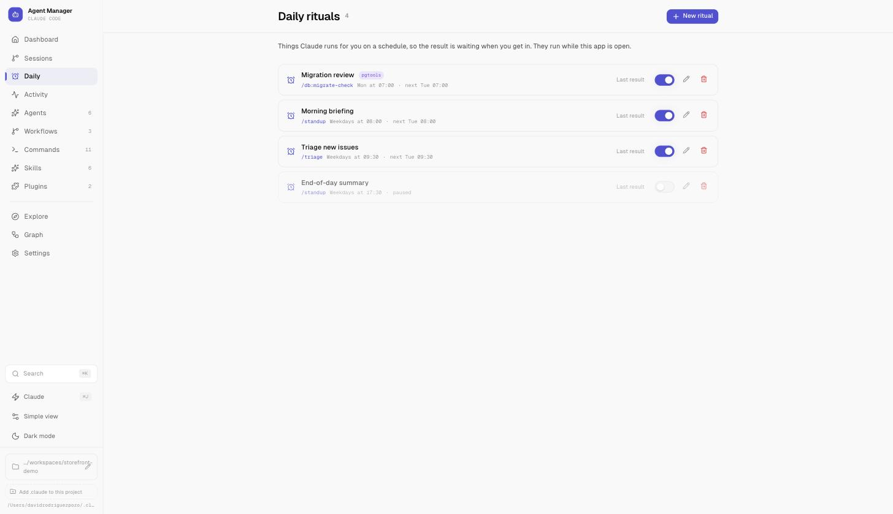

</div>

---

Agents Studio reads the `.claude` directory you already have and the repositories you
point it at. Everything it shows you is a real file or a real branch; everything it
writes is something you could have written by hand. Close the app and nothing is
trapped inside it.

## Alongside Claude Code Desktop

| | Desktop | Here |
| --- | --- | --- |
| Work while you're there | ✅ and better at it | ✅ |
| Runs *your* test suite and blocks a merge on it | — | ✅ |
| Fixes its own failures, up to a limit you set | — | ✅ |
| Stops a scheduled job that has quietly broken | — | ✅ |
| Lands several finished branches in an order that accounts for each other | — | ✅ |
| Sandboxes what an unattended run may reach | — | ✅ |
| A daily spend cap that skips work rather than billing you | Quota display | ✅ |
| Holds work back when you're near your rate limit | Quota display | ✅ |
| Every repository at once, not one window's worth | — | ✅ |
| Fires at 08:00, or when a PR opens, against your local repo | Cloud routines | ✅ |

That last row is the one narrowing. Routines run in Anthropic's cloud, but self-hosted
environments now let Team and Enterprise plans run sessions on their own machines, and
that gap will keep closing. The rows above it are the ones to judge this on: none of
them are about *where* the work runs.

**On the workbench itself, Desktop is better and it is not close.** Panes you can
arrange, a proper diff viewer, an editor with everything an editor has. What is here is
enough to finish a piece of work without leaving — a file editor with syntax colouring, a
real shell, your app running in the page, and one click to put any of it back — and it is
a young version of all four. No bracket matching, no find-in-file, no debugger.

The argument for it is not that it beats Desktop at editing. It is that the work it
verifies, sandboxes and lands is already here, and walking across to another app to
change one line was the thing breaking that loop.

| Section | What it's for |
| --- | --- |
| **Daily** | Rituals — work on a schedule, retried when it blips, stopped when it breaks |
| **Sessions** | Several pieces of work at once, each on its own branch, each verified |
| **Activity** | Every run there has ever been, with cost, duration and outcome |
| **Workflows** | Agents chained into a pipeline, run to the end and kept |
| **Projects** | The repositories you work in — switch between them in a click |
| **Agents · Commands** | Subagents and slash commands, with where each came from |
| **Skills · Plugins · MCP** | What is installed, what it adds, and which of it actually works |
| **Explore · Graph** | Find new things to install; see how what you have connects |

---

## Quick start

```bash
npm install -g agents-studio
agents-studio
```

Open **http://localhost:3000**. Add the project you want to work on from the bottom
of the sidebar — that's the repository sessions will branch from. Add as many as you
work in; switching between them is a click.

To try it once without installing, `npx agents-studio` works too — though it re-downloads
about 19MB whenever the cache misses, so the global install is the better home for
something meant to keep running.

> **You'll need:** Node.js 18+, and Claude Code installed and signed in on this machine.
> Sessions, rituals and workflows run through the Claude Agent SDK, which spawns that
> Claude Code and uses that login; there is no separate key to set up. It is found on
> your `PATH` or where the installers put it — set `CLAUDE_CODE_EXECUTABLE` if yours
> lives somewhere unusual. Nothing is compiled at install time — the package ships its
> own build with dependencies already inside it, so `npm install` has nothing to resolve.

<details>
<summary>From source instead</summary>

```bash
git clone https://github.com/davidrodriguezpozo/agents-ui.git
cd agents-ui
bun install
bun run dev
```

Wants [Bun](https://bun.sh), or Node.js 18+ with `npm` in place of `bun`.
</details>

### Leave it running

A ritual due at 08:00 only happens if something is running at 08:00, so a server you
started in a terminal yesterday is not enough.

```bash
agents-studio install     # start at login and after a crash
agents-studio status      # is it installed, is it answering
agents-studio uninstall   # stop doing that — nothing you own is touched
```

<details>
<summary>From a checkout</summary>

```bash
make service          # build, then start at login and after a crash
make service-status   # is it installed, is it answering
make service-logs     # follow what it is saying
make service-stop     # stop doing that — nothing you own is touched
```

Or without make — note the build first, since the service runs the build rather than
the dev server:

```bash
bun run build
node bin/start.mjs install
node bin/start.mjs status
node bin/start.mjs uninstall
```
</details>

It listens on `127.0.0.1`, so only this machine can reach it. That default is deliberate:
sessions and rituals run commands as you, with your Claude credentials, against your
repositories, and there is no authentication in front of any of it.

What *is* in front of it is a check that every request came from this app rather than
from a web page you happen to have open. Without it, a page you visited could quietly
submit a form to `localhost:3000` and have this run a shell command as you — a form post
needs no permission from the browser to be *sent*, only to be read, and the attacker does
not need to read the reply. Requests from another site are refused, and so is any request
addressed to a hostname this server does not recognise, which is what stops the same trick
being played through DNS. Other programs on your machine are unaffected: they already run
as you, which is the boundary this has always had.

If you reach it through a proxy or a tunnel under your own name, tell it so:

```bash
AGENTS_STUDIO_ALLOWED_HOSTS=studio.my-tunnel.dev agents-studio install
```

To reach it from another device — your phone, say — bind it wider on purpose:

```bash
HOST=0.0.0.0 agents-studio install
```

and understand that on a shared network, anyone who can reach the port can do everything
you can.

If something else already has port 3000 — a Docker container publishing it is the usual
culprit — install refuses and names the occupant, rather than registering a service that
would fail to bind and be restarted forever. Pick another port with `PORT=3001
agents-studio install`; it is written into the service definition, so `agents-studio
status` keeps reporting on the right one afterwards.

Installing is a **deploy**: the build is copied to `~/.claude/agents-ui/installed-build/`
and the service runs the copy. That matters most from a checkout, where `bun run build`
empties `.output` and rewrites it over about a minute — a service running from there would
die on the next chunk it loaded, so working on the code would take down the thing running
your rituals. Run `make service` again to deploy what you have just built. Installed from
npm there is nothing to rebuild; `npm update -g agents-studio` then `agents-studio install`
deploys the new release.

This registers a launchd agent on macOS or a systemd user unit on Linux, and captures the
`PATH` of the shell you install from — a service otherwise gets a bare one with no `claude`
in it, and every run would fail at 08:00 with nobody watching.

Two things it cannot do for you: it will not wake a sleeping machine (an overdue ritual
still fires if you open the lid within a couple of hours, and is skipped after that rather
than arriving at teatime), and it keeps serving the build it was installed against — so
after changing code, or after updating the package, install again.

---

## Projects

The repositories you work in, in a list at the bottom of the sidebar. Add one and it
stays; switching between them is a click, and each says what branch it is on and how
many sessions it holds.

The list lives on disk next to your sessions, not in the browser, so it survives closing
the tab and is the same list whichever browser you open. Removing one is removing a
bookmark: the repository, its worktrees and the sessions that branched from it are all
left exactly where they were.

One project is *active* at a time, because project-scoped configuration comes from
exactly one `.claude` directory and pretending otherwise would make "which agents do I
have" unanswerable. Everything that isn't configuration spans all of them:

- **Sessions** are grouped by repository, so work waiting on you in a project you are
  not currently in still says so — rather than being a title on a row with no status.
- **Rituals** are pinned to a repository, chosen when you write one and defaulting to
  the project you are in. Editing one from somewhere else changes its time, not where
  it runs. *No project* is available here too, for a ritual that works on your own
  configuration rather than on any one repository.
- **Checks** are set per project, as they always were.

**No project** is a real choice too, and the last item in the switcher. It works against
your personal `~/.claude` alone, which is what you want when the agents and skills you
are editing are not any one repository's.

---

## Daily rituals

Work that runs on a schedule: a morning briefing, issue triage, a migration review
before anyone opens the repo. Each ritual is a command, a recurrence and a next run —
and it tells you which ones came from a plugin rather than being written by hand.


### When nobody is there to answer

A scheduled run that hits a permission prompt does not sit and wait for ten minutes and
then deny anyway. It stops immediately, tells you exactly what it was blocked on, and
offers the one narrow rule it needed — `Bash(gh issue edit:*)`, not full access.

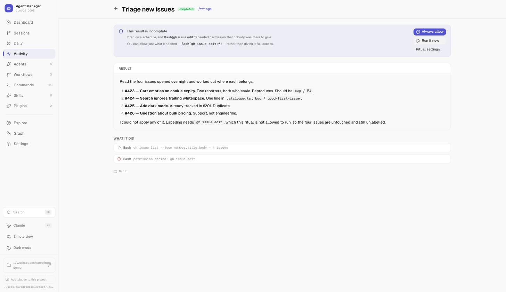

### Whether it still works

The useful question about a ritual is not what happened last time — it's whether it has
quietly stopped working. Each one carries its recent outcomes and expands into them: what
happened, why, what it cost. When the last few runs in a row came to nothing, the row says
so, and says when it last worked.

A finished run is not automatically a successful one. A ritual refused a tool it needed
completes with half the job undone, so that counts against it. A run you stopped by hand
does not.

### Doing something about it

Knowing was never the point on its own. A ritual that breaks on Tuesday used to go on
failing every morning, spending money to produce nothing, until somebody noticed.

**A failure gets one more go, ten minutes later.** Nobody is awake to press the button,
and losing the morning to a dropped connection is a poor reason to have no briefing. Only
a genuine failure, and only the first one — a run that was *refused a tool* is excluded
deliberately, because running it again produces the identical refusal a minute later, for
money. What that needs is the narrow rule it already offers you.

**After three runs in a row come to nothing, it stops firing** and says why. Stopping is
the useful act: it ends the waste, and it is the only way the next failure reaches anybody
instead of joining a queue of identical ones nobody reads. Turning it back on clears the
note — asking for it again is not the moment to bring up what it broke on last week.

### Being told

Work that carries on without you is only useful if it can reach you when it stops being
able to carry on. A blocked permission, a failure, or a turn that ran long enough that you
looked away each raise a **desktop** notification — not a browser one, because the browser
is usually shut, which is the case this exists for. Each kind can be turned off in Settings.

Clicking one opens the session, ritual or workflow it is about. On macOS that takes a small
app bundle of our own, built into `~/.claude/agents-ui/notifier` the first time anything is
sent: notifications belong to an application, and posting them through `osascript` made them
Script Editor's — its icon, and a click that opened an empty script window.

Meanwhile the sidebar counts what is stuck rather than what you own, and the tab title
carries that count too, so it's readable from another window.

---

## Sessions

Each session gets its own branch and its own checkout of your repository, so several
can run at the same time without overwriting each other. Nothing lands in your working
copy until you merge it.

Say what you want done and it starts — the session names itself from the instruction
rather than making you type the intent twice. **Start several at once** takes one
instruction per line and gives each its own branch, workspace and turn, so setting up
five parallel sessions costs one paste instead of five round trips. It counts them
before it does anything, and twenty is the ceiling — each one is a full checkout.

That splitting only happens in the batch box. Multi-line text in the ordinary one is a
single prompt, because turning a carefully written paragraph into eight sessions is not
a mistake worth discovering afterwards.

The list is about *what each session has produced* — files changed, commits, work still
uncommitted, turns taken — rather than about the fact that something is running.

A turn heading in the wrong direction can be stopped from the session itself. Stopping ends
the turn, not the work: whatever it already wrote is still in the workspace, and still in
the diff.

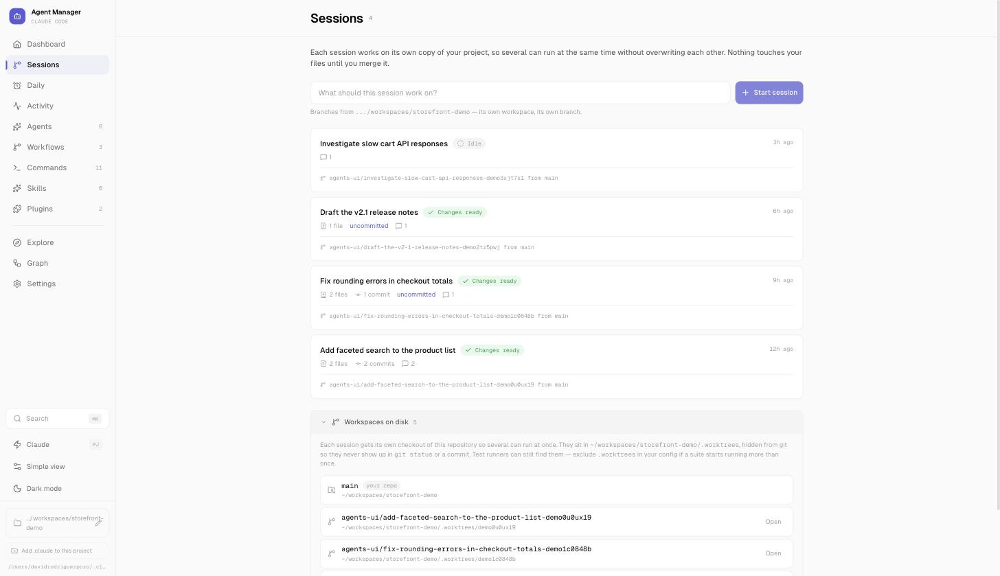

Checkouts live in `.worktrees/` inside your repo and are hidden from `git status` via
`.git/info/exclude`, so they never show up in a commit by accident. **Workspaces on disk**
lists every one git actually knows about, so none of them quietly accumulate.

### Read it, then decide

<table>
<tr>
<td width="50%">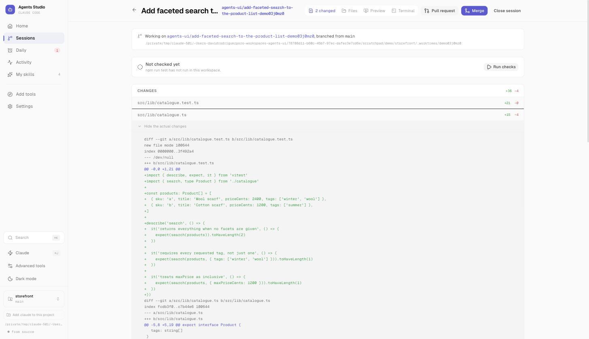</td>
<td width="50%">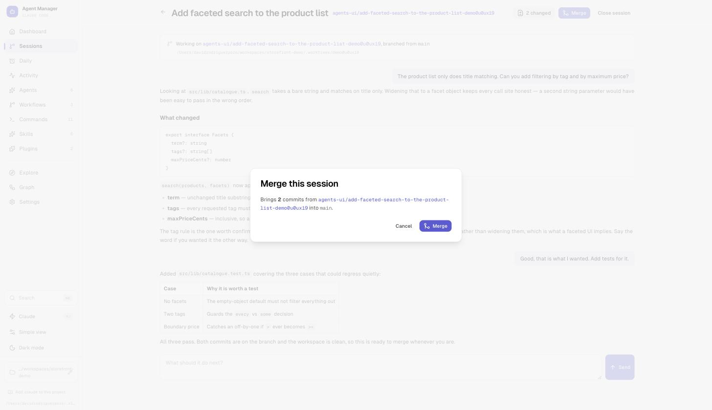</td>
</tr>
<tr>
<td><b>What changed</b>, per file, next to the conversation that produced it.</td>
<td><b>Merge</b> tells you what is about to be brought across and into which branch, and whether the project's own checks pass, before it touches your checkout.</td>
</tr>
</table>

The conversation itself is rendered properly — headings, lists, tables and code, the way
the agent wrote them.

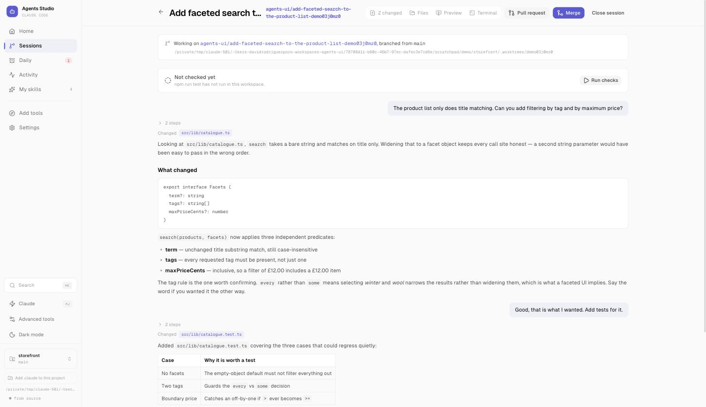

### What it did

The list could always tell you a session changed four files across three turns. It could
never tell you *what it did* — which is the thing you need in order to decide whether to
look closer, and the only thing on the row a non-programmer can act on.

So after a session changes something, a small model writes one sentence from its diff and
its closing message, and that sits on the row:

> **Add a maximum file size limit of 5MB to the upload…**
> Upload function now rejects files larger than 5MB.

It costs just under a cent per turn that changes files. That is small next to the turn
that produced the work but it is not nothing, so it can be turned off in Settings, and it
is reported on the spend page as its own **summary** line rather than disappearing into
the background — the honest way to let you decide whether it earns its keep.

### Whether it works

A diff tells you what changed. It does not tell you whether the result runs, and that is
the question almost everyone is actually asking — certainly anyone reviewing six sessions
at once, and anyone who does not read diffs for a living.

So your project's own checks run in the session's workspace, after any turn that changed
files. A turn that only answered a question doesn't trigger a test suite. The verdict goes
on the session, so the list says **Checks pass** or **Checks failed** rather than the
meaningless "changes ready", and a session that does not work sorts to the top with the
ones that need you.

**A failing session will not merge** until you say so. The merge dialog shows the failure
and offers *Merge anyway* — because sometimes the base branch is already red, and a gate
with no way through is a gate people route around. Taking it is recorded in the merge
commit, so "was this known to be broken when it landed" has an answer later.

Four distinctions it is careful about:

- **Failing is not the same as not running.** A workspace missing its dependencies, or a
  command that isn't on `PATH`, exits non-zero and means nothing about your code. Those
  are reported as having no verdict, and they never block a merge.
- **A verdict has a shelf life.** Edit the workspace after a run and the result is marked
  as describing code that no longer exists, rather than quietly believed.
- **So does the base it was taken against.** Merge one session and every other one is
  suddenly verified against a `main` that no longer exists. Git will catch a textual
  conflict; it has nothing to say about one session renaming a function another one calls.
  Sessions show how far behind they are, and offer to bring the base in and re-check in
  one go.
- **Checks queue per repository.** Six sessions finishing together would otherwise build
  the same project six times at once, which thrashes the machine and breaks any suite
  that binds a port.

The command is guessed from your repository — a `check` target in your `Makefile`, a
`check` or `test` script in `package.json`, `Cargo.toml`, `go.mod`, `pytest` — and is set
per project in Settings. Telling it your project has no checks is a real answer, and it
stops asking.

### Making the workspace runnable first

A worktree is a bare checkout: the tracked files and nothing else. No `node_modules`, no
`.venv`, no generated types. So a check running there is being asked to test a workspace
that cannot run anything — and it fails in a way that looks like broken code rather than
a missing install.

It hides rather than failing loudly, too. Worktrees live inside the repository, so Node
walks up and finds the main checkout's dependencies by accident; the command half-starts
and then dies on something generated that isn't there. On the machine this was found on,
fifteen sessions had no verdict between them and nothing said why.

So a project has a **setup command** as well as a check command, guessed from your
lockfile and set in Settings beside it. It runs once per workspace, before the first
check — lazily, so starting a session stays instant and the minute it costs is paid when
something actually wants the answer.

### Finishing it without leaving

A diff tells you what changed. The checks tell you whether it still passes. Neither
answers *that is nearly right, let me change one line* — and the answer to that used to
be: find the worktree on disk, open your editor, open a terminal, start the dev server,
go to localhost. Four trips out of an app built so you would not have to make them.

A session opens on its conversation. One strip above it holds four views of the same
workspace, one at a time, and closing the one you are on gets you back to just the
conversation.

| | |
| --- | --- |
| **Changes** | The diff, per file, against where the session branched |
| **Files** | Browse and edit the workspace. A save lands in the session's branch exactly like something the agent wrote, so the checks go stale and want running again |
| **Terminal** | A real shell in the workspace, on the session's branch. It keeps running when you close the tab, because a long build should survive navigating away |
| **Preview** | Your project's dev command, on a port of its own, shown in the page |

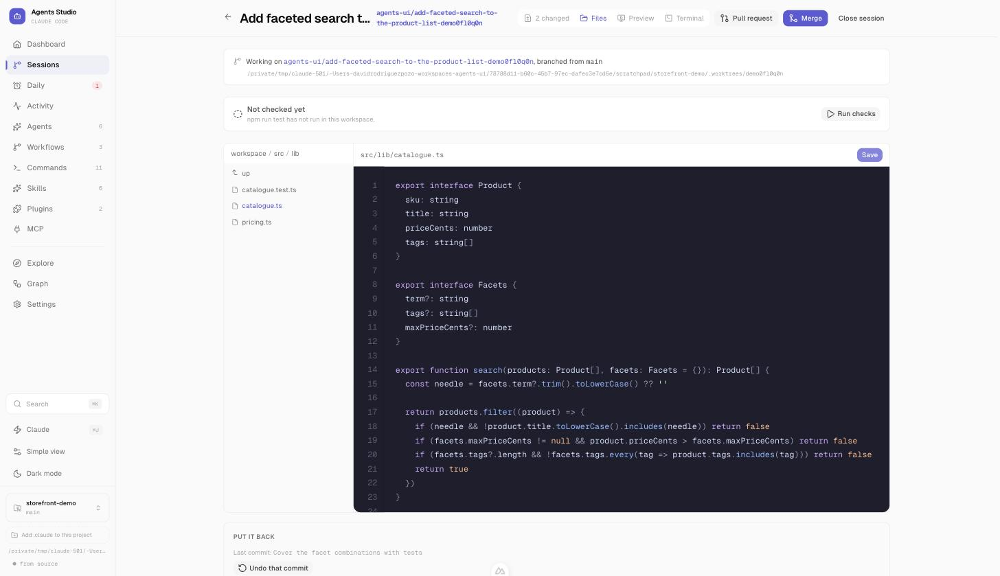

<table>
<tr>
<td width="50%">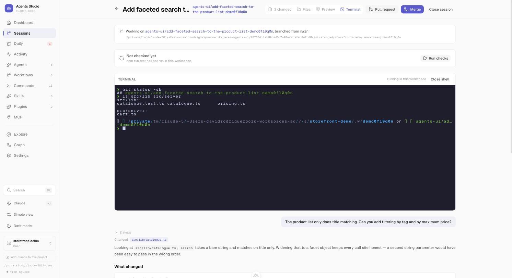</td>
<td width="50%">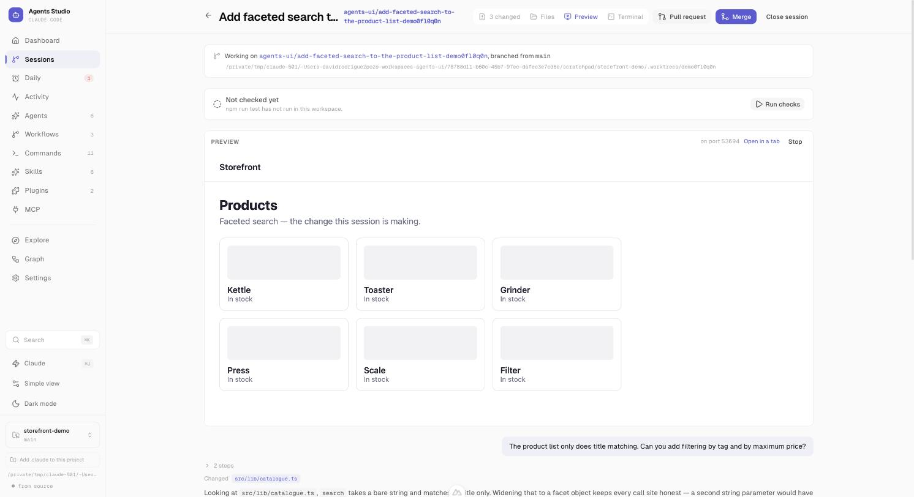</td>
</tr>
<tr>
<td><b>A shell</b> in the workspace, on the session's branch — the same one the diff is about.</td>
<td><b>The app itself</b>, from this session's code, on a port of its own.</td>
</tr>
</table>

Each one is a *young* version of the thing it replaces — the editor colours nine
languages and numbers the lines, and that is the whole of it. What they are for is
finishing, not living in.

**Putting it back** sits beside the editor, because being able to change a file by hand
is what makes undo matter. Two things, kept apart: throw away what is uncommitted, or
take a whole turn off. Both name the files rather than counting them, and neither can
reach past the commit the session branched from — your repository's own history is not
this session's to undo.

The preview gets a port from the kernel rather than a guess, because several sessions
running at once is the point of worktrees and two dev servers fighting over 3000 is not.
It is handed over in `PORT`; a project that hardcodes one instead will have its sessions
collide, which the page says rather than pretends to have solved.

---

## Reviews

A session ends at a pull request, and that used to be where this app stopped looking. It
is not where the work stops. Somebody asks for a change on Tuesday, CI goes red on the
third push, a review is requested from you while you are inside something else — all of
it on github.com, which is a tab you have to remember to open.

**Reviews** asks the two questions you open that tab for, in the project you are already
in: *what is waiting on me*, and *where has my own work got to*. Read through `gh`, with
the sign-in you already have — no token to paste, nothing stored, nothing listening on a
port.

Each pull request gets one verdict rather than eight fields to assemble yourself, and the
list is sorted by whether the next move is actually yours:

| | |
| --- | --- |
| **Conflicts** | It collides with its base, so nothing downstream of that means much |
| **Changes requested** | Somebody reviewed it and wants something — with how many threads are still open |
| **Unanswered** | Comments left on the diff that nobody has resolved |
| **CI red** | Which checks failed, by name, linked to the run |
| **Ready to merge** | Approved, green, mergeable — and it says so when nothing reported |
| **In review** | Waiting on a named reviewer. Not your problem this minute |

A person outranks a robot: a pull request that is both red *and* has a reviewer waiting
reads as the second, because only one of those is somebody sitting at the other end.

**Then the row turns into a session.** That is the part a list of links cannot do. One
press cuts a worktree with the branch checked out and starts a turn that knows why it is
there — read this diff and tell me what is wrong with it; work out why CI went red and
fix the failure rather than the check; do what the reviewer asked, and say so where you
think they are wrong. Nothing is posted to GitHub by any of them. The review comes back
into the session for you to read, because a review left under your name that you have not
read is the worst thing this could possibly do for you.

Merging is the exception and is treated like one: it only appears on your own pull
request, only when it is genuinely ready, and the page re-reads GitHub at the moment you
press it rather than trusting what it drew ten minutes ago.

---

## What a run may touch

Sessions and rituals run shell commands as you. This is the thing that tells you to walk
away from one at 08:00, so **runs are sandboxed by default** — including in projects that
were set up before the setting existed. Commands reach only the hosts you list, and a run
cannot let *itself* out; widening is something you do in Settings, on purpose.

It pays twice. A sandboxed command does not need to stop and ask, so the failure this
spends the most effort on — a ritual back in the morning having been refused a tool, with
half its job undone — largely stops happening.

When something is refused, the run says which host it wanted, counts as needing you
rather than as a clean success, and offers to allow exactly that host in that repository.
A project with rituals that already ran is told all of this once, before anything breaks.

Your own checks are unaffected either way: those are commands you configured yourself,
and they run outside the sandbox. So does the terminal — a person typing into their own
shell is what the sandbox protects *from being impersonated*, not what it protects
against.

---

## Activity

Every run there has ever been — scheduled work, agent invocations and session turns —
with what it cost, how long it took and how it ended. Runs keep going if you close the
tab; the log replays for whoever attaches next.

Filter by what started it and how it ended, and search what a run *said* rather than only
what it was called. Searching covers the whole log, not the page of it on screen.

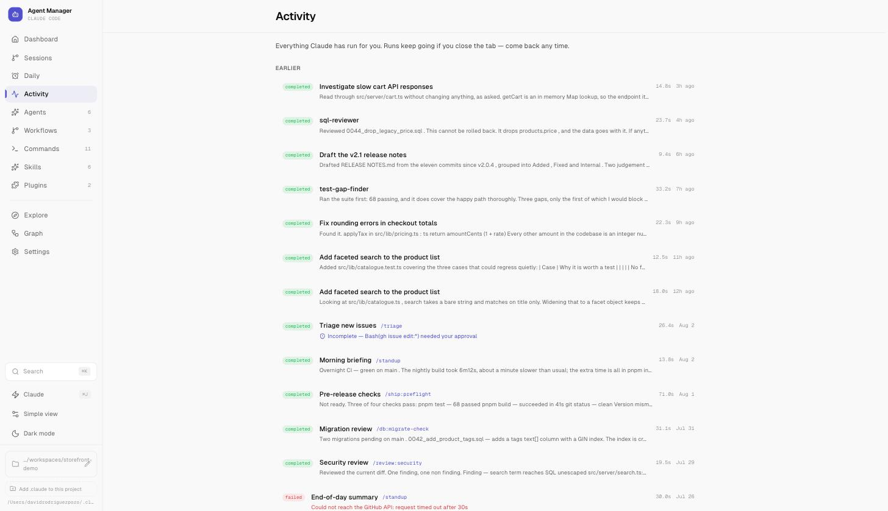

---

### Spending limits

The chart above says what a day cost, which answers the question a day late. Limits stop
things instead. Both are off until you set them, in Settings.

**Most per day** covers everything — sessions, rituals, summaries. Once reached, a session
refuses to start a turn and a ritual is skipped rather than run, each saying so plainly.
A skipped ritual moves on to its next occurrence without recording a run, so it does not
show up later as a ritual that has started failing.

**Most per run** is the only limit that can stop work part-way, and it is enforced by the
Agent SDK rather than by us — no price list here to go stale. It is checked between turns,
so a single expensive turn can overshoot it: a one cent limit stopped a run that had
already spent six. Read it as "stop after about this", not as a ceiling.

A run stopped by either is marked as needing you, keeps whatever it wrote, and records
what it spent — a limit whose own enforcement was invisible to the spend page would be a
poor limit.

---

## Backups

Your rituals and sessions only exist on this machine. They are snapshotted
automatically to a folder **outside** the app's own directory, so a backup survives that
directory being deleted — and can be restored from the same panel.

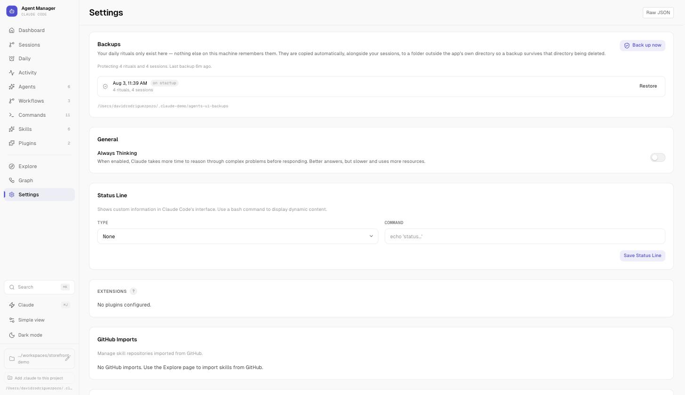

---

## Agents, commands and workflows

<table>
<tr>
<td width="50%">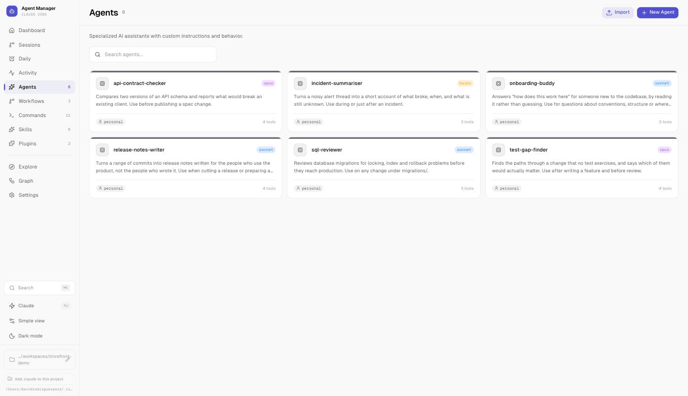</td>
<td width="50%">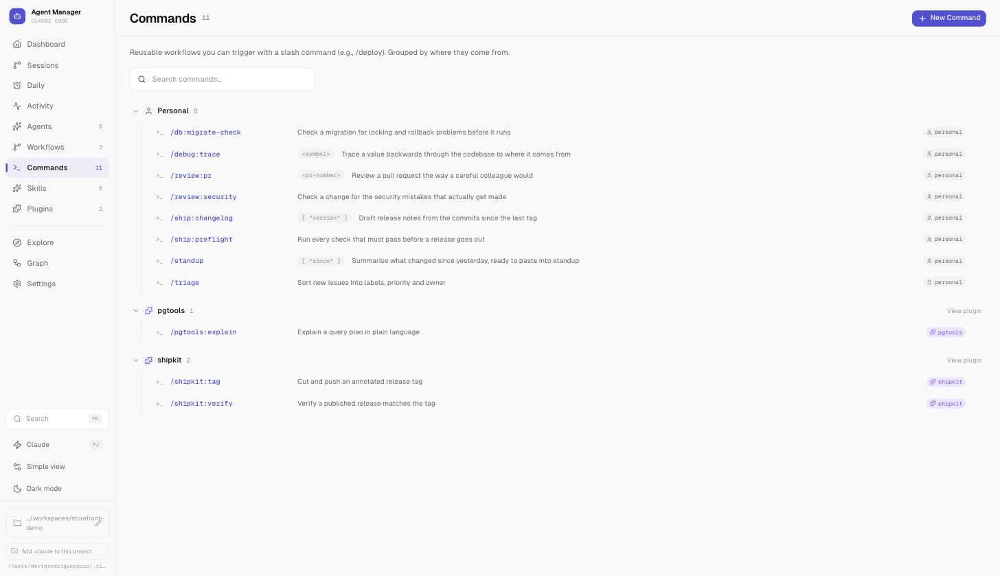</td>
</tr>
<tr>
<td><b>Agents</b> — what each one is for, which model tier it runs on, and how many tools it is allowed.</td>
<td><b>Commands</b> — grouped by where they come from, with their argument hints, so a plugin's command is never mistaken for yours.</td>
</tr>
</table>

**Workflows** chain agents into a pipeline. Each step is resolved to a real agent and the
model it will actually run on, so the cost of the whole thing is visible before you press Run.

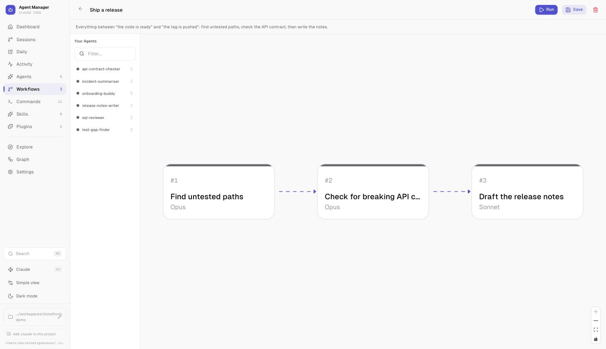

---

## Also in the box

- **Skills** — write them, or import them from a GitHub repository by URL
- **Plugins** — browse registered marketplaces and install without leaving the app
- **Graph** — how your agents, commands, skills and plugins actually connect
- **Explore** — templates and community skills, in one place
- **Ask Claude** (`⌘J`) — a chat panel that knows about your configuration
- **Version and updates** — which release you are on, and one click to a newer one
- **Search** (`⌘K`) — across everything at once
- **Simple view** — hides the configuration concepts and leads with what you can run today
- **Dark mode** — from the sidebar, any time
- **Settings** — status line, extensions, GitHub imports, and the raw JSON when you want it

---

## Configuration

The Claude directory can be set from the sidebar at any time; the environment variables
are there for when you'd rather pin it.

| Variable | What it does | Default |
| --- | --- | --- |
| `CLAUDE_DIR` | Which Claude config directory to read and write | `~/.claude` |
| `PORT` | Port to serve on | `3000` |
| `HOST` | Host to bind | `0.0.0.0` |

---

## Development

```bash
make            # list every target
make setup      # install dependencies
make dev        # hot reload, on PORT (default 3000)
make check      # tests and typecheck, which is what CI runs
```

`make dev PORT=3001` if the background service already has 3000, and `PKG=npm` throughout
if you would rather not use Bun. Every target is a plain command you could type yourself —
the Makefile just remembers which ones need a build first.

### Demo data

The screenshots above come from a self-contained demo environment — its own Claude
directory and its own git repository, so nothing private can end up in a screenshot by
accident. Sessions in it get real worktrees, which is why the file counts, commit counts
and merge preview are real numbers rather than mock-ups.

```bash
make demo        # build it (~/.claude-demo) and serve it on 3200
make demo-stop   # remove it again
```

### Tech stack

[Nuxt 3](https://nuxt.com) (v4 compatibility mode) · [Vue 3](https://vuejs.org) · [Nuxt UI](https://ui.nuxt.com) +
Tailwind CSS · [VueFlow](https://vueflow.dev) for the graph and the workflow canvas ·
[Claude Agent SDK](https://github.com/anthropics/claude-agent-sdk-typescript) for runs ·
[Bun](https://bun.sh)

---

## Contributing

Contributions are welcome — see [CONTRIBUTING.md](CONTRIBUTING.md) for setup and
guidelines, and the [issues](https://github.com/davidrodriguezpozo/agents-ui/issues)
labelled `good first issue` for somewhere to start.

## License

[MIT](LICENSE)
